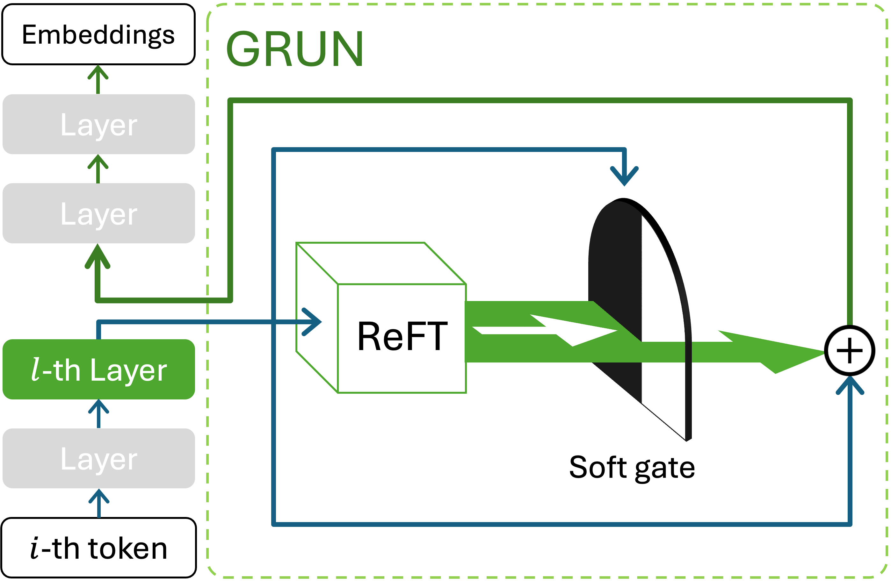

<div align='center'>
 
# A General Framework to Enhance Fine-tuning-based LLM Unlearning

[](https://arxiv.org/abs/2502.17823)
[](https://github.com/renjie3/GRUN/blob/main/LICENSE)
[](https://github.com/renjie3/GRUN)
[](https://github.com/renjie3/GRUN)
[](https://github.com/renjie3/GRUN)

</div>

<table align="center">
  <tr>
    <td align="center"> 
       
      <br>
      <em style="font-size: 18px;">  <strong style="font-size: 18px;">Figure: </strong>GRUN consists of two plug-and-play components explicitly for distinguishing and suppression: a soft gate function to distinguish target data, and a ReFT module to suppress target-data-related generation.</em>
    </td>
  </tr>
</table>

Official code for **A General Framework to Enhance Fine-tuning-based LLM Unlearning**

Unlearning has been proposed to remove copyrighted and privacy-sensitive data from Large Language Models (LLMs). Existing approaches primarily rely on fine-tuning-based methods, which can be categorized into gradient ascent-based (GA-based) and suppression-based methods. However, they often degrade model utility (the ability to respond to normal prompts). In this work, we aim to develop a general framework that enhances the utility of fine-tuning-based unlearning methods. To achieve this goal, we first investigate the common property between GA-based and suppression-based methods. We unveil that GA-based methods unlearn by distinguishing the target data (i.e., the data to be removed) and suppressing related generations—essentially the same strategy employed by suppression-based methods. Inspired by this finding, we introduce Gated Representation UNlearning (GRUN) which has two components: a soft gate function for distinguishing target data and a suppression module using Representation Fine-tuning (ReFT) to adjust representations rather than model parameters. Experiments show that GRUN significantly improves the unlearning and utility. Meanwhile, it is general for fine-tuning-based methods, efficient and promising for sequential unlearning.

## Necessary dependencies

environment.yml

We modified the files to accommodate the output of gate: ./pyvene_custom/models/intervenable_base.py ./pyvene_custom/models/interventions.py. You can also install the lastest pyvene and change the code highlighted by comment "GRUN", which is very short.

## How to use

### 1. TOFU

#### Finetune vanilla llama3.1 and mistral to learn TOFU
- Detailed CMD of finetuning can be found in **cmd_finetune.sh**

#### Baseline: GD, IDK, NPO, and their loRA
- Detailed CMD of baseline can be found in **cmd_baseline.sh**

#### GRUN
- Detailed CMD of GRUN can be found in **cmd_grun.sh**

#### Evaluation
- Detailed CMD of evaluating baseline and GRUN can be found in **cmd_eval.sh**
- Baseline or GRUN is set by BASE_OR_REFT.

### 2. WMDP

Detailed CMD of GRUN and evaluation can be found in **cmd_wmdp.sh**

Baseline is unlearned using [original repo](https://github.com/centerforaisafety/wmdp) with the following cmd

```
python3 -m rmu.unlearn --model_name meta-llama/Llama-3.1-8B --batch_size 4 --layer_ids 13,14,15 --layer_id 15 --max_num_batches 150 --layer_ids 13,14,15 --layer_id 15 --retain_corpora wikitext,wikitext --forget_corpora bio-forget-corpus,cyber-forget-corpus --steering_coeffs 30,30 --alpha 350,350 --lr 5e-5 --seed 42 --output_dir models/llama3_rmu_param18
```

```
python3 -m rmu.unlearn --model_name mistralai/Mistral-7B-v0.1 --batch_size 4 --layer_ids 13,14,15 --layer_id 15 --max_num_batches 150 --retain_corpora wikitext,wikitext --forget_corpora bio-forget-corpus,cyber-forget-corpus --steering_coeffs 27,27 --alpha 1600,1600 --min_len 200 --lr 5e-5 --seed 42 --output_dir models/mistral_rmu_param19
```

## Cite
```
@article{ren2025general,
  title={A General Framework to Enhance Fine-tuning-based LLM Unlearning},
  author={Ren, Jie and Dai, Zhenwei and Tang, Xianfeng and Liu, Hui and Zeng, Jingying and Li, Zhen and Goutam, Rahul and Wang, Suhang and Xing, Yue and He, Qi},
  journal={arXiv preprint arXiv:2502.17823},
  year={2025}
}
```
